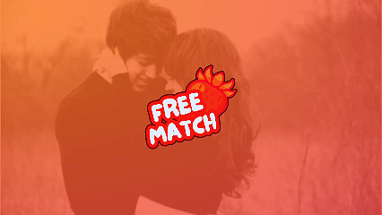
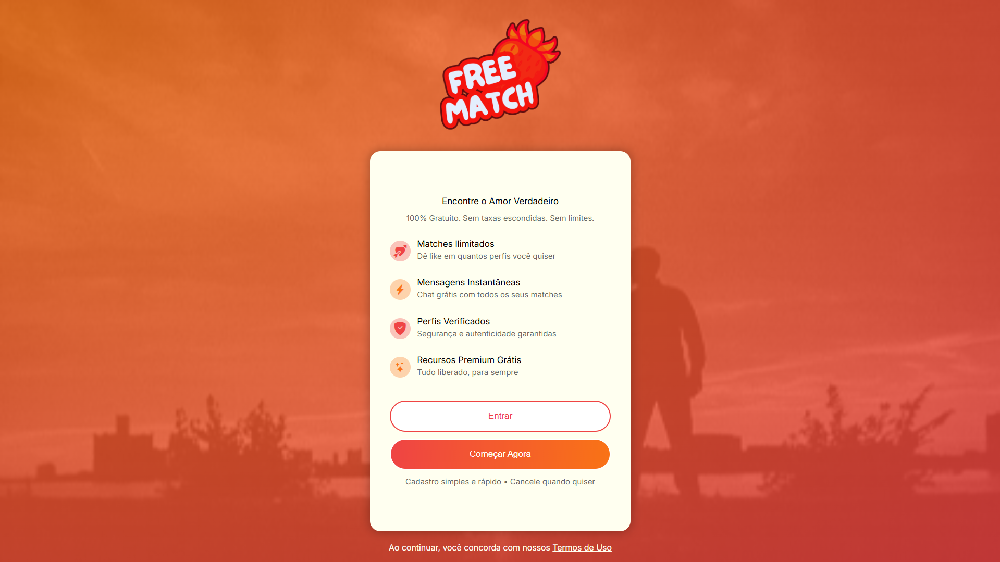
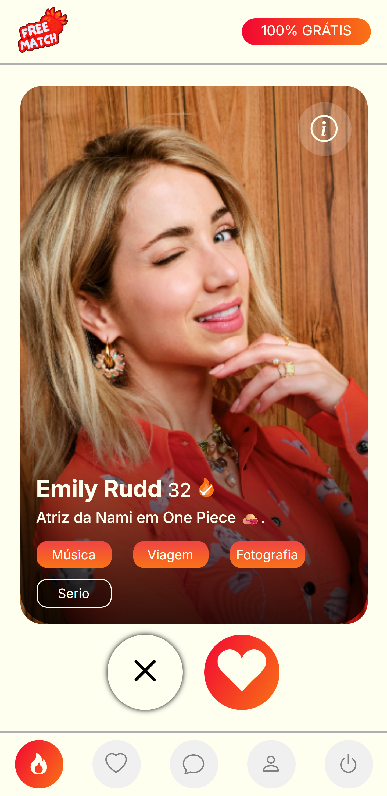
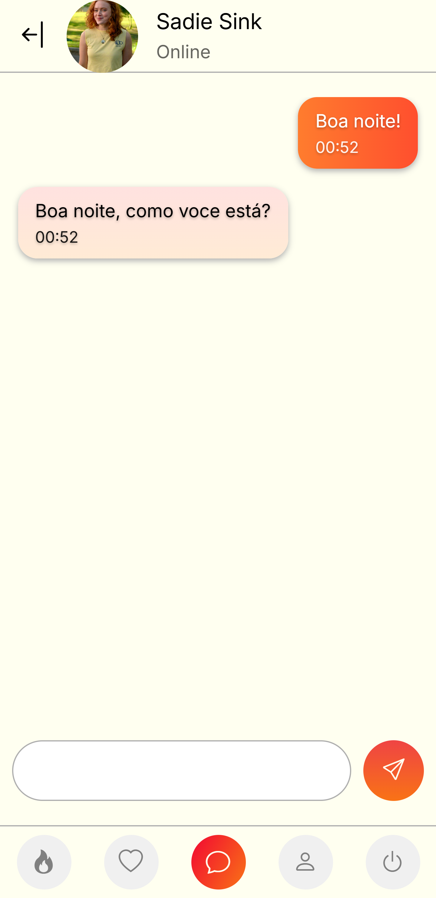
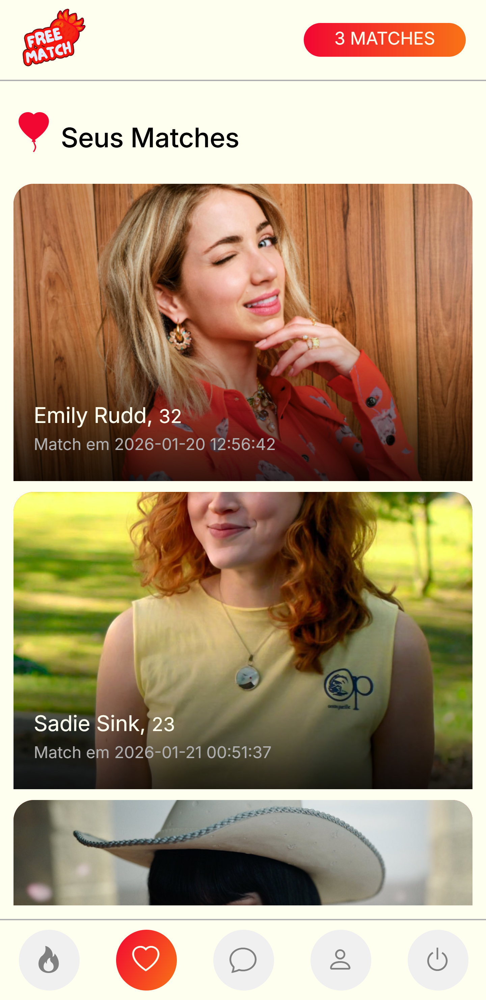
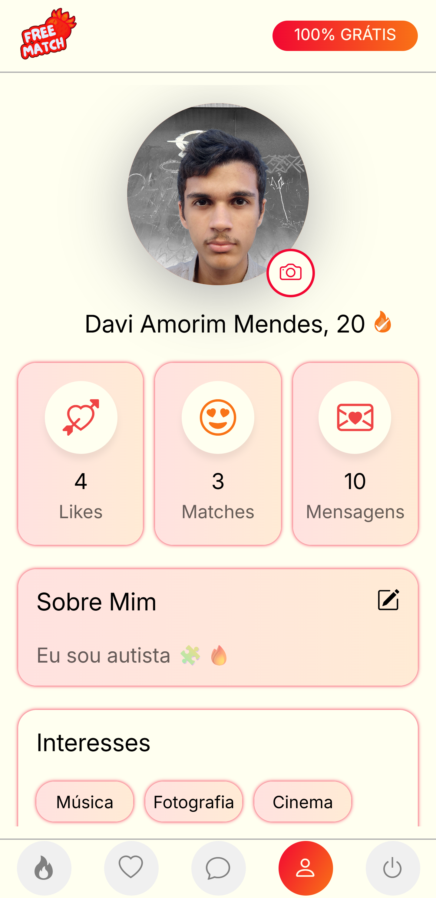

  

  
  
  

 
 

<h1 align="center">🎯 Sobre</h1>

O FreeMatch é uma plataforma de relacionamentos moderna e inclusiva, criada para quebrar a barreira dos "paywalls" em encontros online. Aqui, o amor não tem preço: todas as funcionalidades são 100% gratuitas.

 
 

---

<h1 align="center">📱 Visual da Plataforma</h1>

  
   
  
  

---

<h1 align="center">✨ Funcionalidades Principais</h1>

    ♨︎ Matches Ilimitados ♨︎  
    Curta quantas pessoas quiser, sem limites diários.  
    ♨︎ Chat Sem Fronteiras ♨︎  
    Inicie conversas e envie mensagens sem pagar por pacotes.  
    ♨︎ Busca Inteligente ♨︎  
    Filtre usuários por interesses e estilo de vida.  
    ♨︎ Sem Premium ♨︎  
    Não existem contas VIP. Todos os usuários têm os mesmos privilégios. 

 

  
  

---

<h1 align="center">🛠️ Tecnologias Utilizadas</h1>

O projeto foi desenvolvido com as seguintes tecnologias:

  

---

<h1 align="center">🤝 Contribuições</h1>

Este é um projeto totalmente gratuito! Se você quer ajudar a manter o amor no mundo, contribua com qualquer valor pelo pix:

  

<a href="https://freematch-web.onrender.com">https://freematch-web.onrender.com</a>

---

  Desenvolvido com ❤️ por <a href="https://github.com/davi-amorim-mendes">Davi Amorim Mendes</a>

